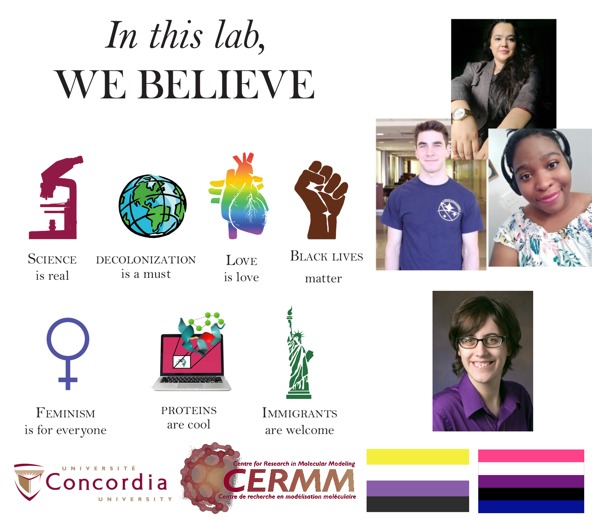

# Welcome to the Mansbach Lab!
{: .display-4}
 
We are part of the [Department of Physics](https://www.concordia.ca/artsci/physics.html) and affiliated with the [Centre for Research in Molecular Modeling](https://www.concordia.ca/research/molecular-modeling.html) 
{: .welcomefont}

{:style="max-width: 100%; height: auto;"}

We do research on physics-based rules for creating interpretable design spaces for therapeutics.

Our lab poster was modified from [Sammy Katta's website](https://sammykatta.com/diversity).

Poster text reads:

In this lab, we believe: science is real (microscope image), decolonization is a must (picture of earth), love is love (rainbow anatomical heart), black lives matter (brown raised fist), feminism is for everyone (female symbol), proteins are cool (image of model), immigrants are welcome (statue of liberty).

Pictures of the lab group are along the side, the Concordia and CERMM logos are at the bottom, next to the non-binary and genderfluid flags.

{: .welcomefont}

{: .welcomefont}
